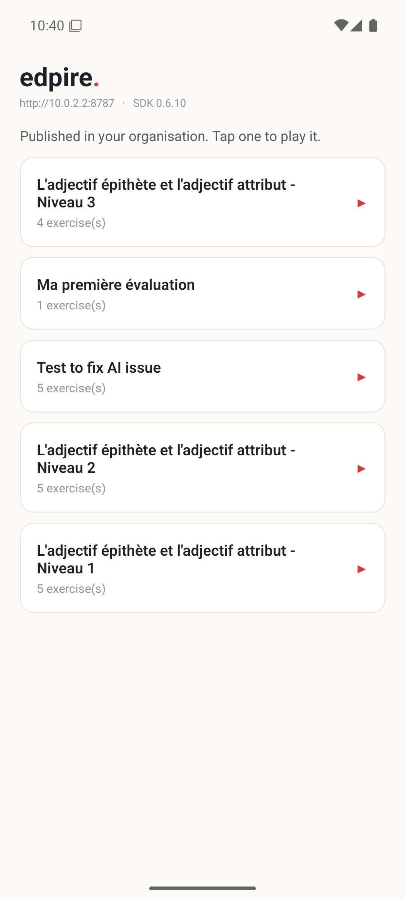
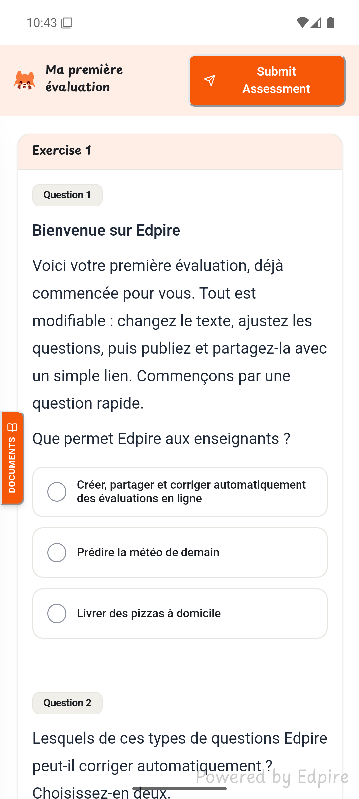
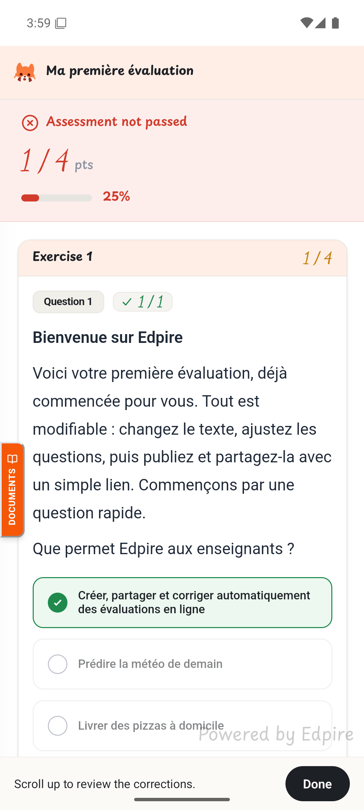
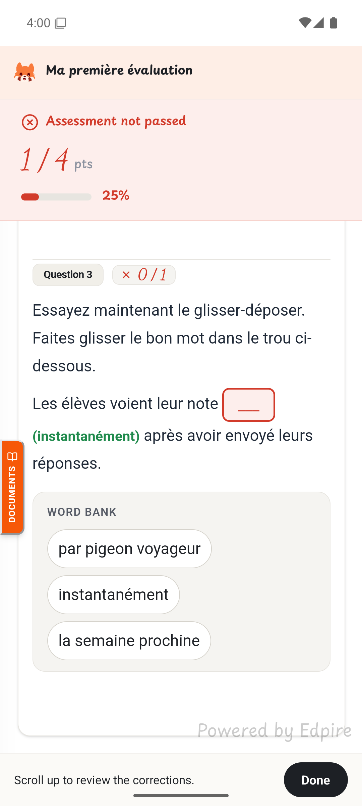

# Edpire + React Native

A minimal, working example of embedding an [Edpire](https://edpire.com) assessment in a React Native app.

The Edpire player runs inside a WebView, so this same approach works in Expo, bare React Native, Flutter, or native iOS and Android. Only the wrapper changes.

<table>
<tr>
<td width="25%"></td>
<td width="25%"></td>
<td width="25%"></td>
<td width="25%"></td>
</tr>
<tr>
<td align="center"><sub><b>1.</b> Pick by title, not by ID</sub></td>
<td align="center"><sub><b>2.</b> The player, in a WebView</sub></td>
<td align="center"><sub><b>3.</b> Graded in place</sub></td>
<td align="center"><sub><b>4.</b> Answer key revealed</sub></td>
</tr>
</table>

Everything from screen 2 onward is the Edpire SDK. You write screen 1 and about forty lines of server code.

---

## What is in here

```
server/   a token endpoint, ~40 lines of Node    <- your API key lives here
app/      the Expo app                           <- never holds an API key
```

Three files in `app/src/` are the entire integration, and they are worth reading in this order:

| File | What it does |
|---|---|
| `tokenService.ts` | Lists assessments, and asks your server for a token |
| `buildPlayerHtml.ts` | Builds the page the WebView runs. The only place native and web meet |
| `AssessmentScreen.tsx` | Renders the WebView and handles messages coming back |

**`server/` is not a service you deploy.** In your real product it is one route inside the backend you already have, sitting next to the session it reads from. It is a separate folder here only because this example has no existing app to put it in.

## Why a server is required

Your Edpire API key must never ship inside the app. Anyone can unzip an APK and read its strings, so a key in the app is a public key.

Your backend instead mints a **short-lived token**, scoped to one learner and one assessment, expiring in two hours. The app receives only that.

```
React Native ──POST /api/edpire/token──▶ your server ──▶ Edpire
                                         (holds the API key)
     ◀────────────── { token } ───────────────────────────
     │
     └──▶ WebView loads the player with that token
```

There is a second reason, and it is the one people miss. Something has to answer *"which learner is this?"* in a way the learner cannot forge. If the app claims to be learner 42, any learner can submit results as any other. That is why the app sends only an assessment ID, never a learner ID.

---

## Run it

**Prerequisites:** Node 20.6+, an Edpire API key, one published assessment, and the [React Native Android setup](https://reactnative.dev/docs/set-up-your-environment) if you want to run on Android.

### 1. Start the token server

```bash
cd server
npm install
cp .env.example .env      # paste your EDPIRE_API_KEY into it
npm start
```

On start it prints the published assessments it can see, which is the quickest way to confirm your API key works:

```
Published assessments (showing up to 5):
  72aff028-8133-46b5-8330-ed2938a2344b  Ma première évaluation
  8bc07441-a4b1-4f06-88b3-9d7ccc7426e2  Test to fix AI issue
```

If that list is empty, create and publish an assessment in Edpire first. Only published assessments can be played, and the app will tell you the same thing with a link to the [quickstart](https://docs.edpire.com/quickstart).

### 2. Run the app

```bash
cd app
npm install
npx expo run:android      # or: npx expo run:ios
```

**Notice there is nothing to configure.** The app asks your server which assessments are published and lists them by title, so nobody ever reads or types an Edpire UUID. That is the pattern you want in your own admin too.

**You do not need to configure your IP address.** The app reads the Expo dev server's own host and points the token server at the same machine, which is correct for both a physical device and an emulator. Set `EXPO_PUBLIC_TOKEN_SERVER` only when you want to override it, which you will in production.

<details>
<summary>Using Expo Go instead of a native build</summary>

`react-native-webview` is included in Expo Go, so `npx expo start` and scanning the QR code works for a quick look. A native build (`expo run:android`) is closer to what you will ship and is what these screenshots came from.
</details>

---

## The integration, in full

Everything else in this repo is scaffolding. This is all of it:

```tsx
// 1. Ask YOUR server for a token. The app never names the learner:
//    the server decides that from its own session.
const token = await mintToken(assessmentId);

// 2. Hand it to a WebView running the player.
<WebView
  source={{ html: buildPlayerHtml(token) }}
  originWhitelist={['*']}
  onMessage={(event) => handleMessage(event.nativeEvent.data)}
  javaScriptEnabled
/>
```

and inside that HTML:

```html
<div id="root" style="height: 100vh"></div>
<script src="https://cdn.jsdelivr.net/npm/@edpire/sdk@0.6.10/dist/umd/index.global.js"></script>
<script>
  EdpireSDK.EdpireAssessment.mount({
    token: "...",
    container: "#root",
    onComplete: function (r) {
      window.ReactNativeWebView.postMessage(JSON.stringify({ type: "complete", payload: r }));
    }
  })
</script>
```

The bundle carries its own React inside a closure, so the React version in your app is irrelevant to it and the two cannot collide.

---

## Stay in the player after submitting

When the learner submits, the player rewrites itself into the corrected paper: a score banner, per-question marks, and the answer key on anything they missed. Screens 3 and 4 above are that view.

That review is most of the value of an assessment, so this example does **not** navigate away in `onComplete`. It records the result and shows a thin bar underneath, leaving the corrections on screen for as long as the learner wants. Replacing the player with a native "you scored 1/4" screen is easy to write and throws away the part that teaches.

## Treat the result message as a UI hint

It is the fastest way to show a score, and it is a client callback. Record the authoritative result server-side from the [`submission.graded` webhook](https://docs.edpire.com/developer/webhooks). If the assessment contains open-response questions the first score is provisional: check `awaiting_manual_grading` and wait for `submission.grading.completed`.

---

## Things that will cost you an hour

Every one of these is already handled in the code. They are listed because each cost us real time to find.

**`postMessage` takes a string.** React Native's bridge is not `window.postMessage`. Send an object and the native side receives `"[object Object]"`. Everything goes through one `send()` helper in `buildPlayerHtml.ts` so this is decided in exactly one place.

**`originWhitelist={['*']}` is required for inline HTML.** Without it the WebView refuses to load anything from `source={{ html }}`, because an inline document has no origin to match against.

**The container needs an explicit height.** The player fills its container, and a container with no height collapses to zero. The player vanishes with no error. Hence `height: 100vh` on `#root`.

**Drag-and-drop needs a press-and-hold.** On touch, hold a draggable item still for about 120 ms before it lifts. A tap-and-flick does nothing. This is deliberate: without it, every scroll that began on a draggable word would drag the word instead. It catches automated tests hardest, because synthetic gestures start moving immediately and report drag as broken when it works fine with a real finger.

**Both platforms block plain HTTP.** Android has refused cleartext since API 28, and iOS blocks it through App Transport Security. The token server in development runs on `http://`, so both need an exception. Handled in `app.json` via `usesCleartextTraffic` for Android and `NSAllowsLocalNetworking` for iOS. In production your backend is HTTPS and neither applies.

**Android mixed content.** The page is inline data with no scheme while the SDK and API are `https`. Android treats that as mixed content and blocks the requests silently unless `mixedContentMode="always"` is set.

**Nothing to register for mobile.** The embed player is origin-scoped on the web, and a WebView loading inline HTML has an opaque origin. Edpire accepts that deliberately, so there is no origin to add for mobile. The token is what authorises the request.

**Pin the SDK version.** `@edpire/sdk` is pre-1.0, so minor releases can change behaviour. `Config.sdkVersion` pins it. Bump it on purpose.

**The bundle is around 700 KB gzipped**, because it carries React, the maths renderer and the rich text engine. Load it on the screen that runs the assessment, not at app start.

---

## Troubleshooting

| Symptom | Cause |
|---|---|
| The list is empty | Nothing is published in your org. Create and publish an assessment in Edpire, then pull to refresh. Drafts never appear. |
| Stuck on "Minting a token" | The device cannot reach the token server. Check it is running, and that the device is on the same network as your laptop. |
| "Failed to connect to Edpire" | The device reached your server but the WebView could not reach Edpire. Check connectivity, and that you are on `@edpire/sdk` 0.6.10 or later. |
| Player area is blank | The container collapsed to zero height, or the SDK bundle did not load. Check your terminal for `[webview]` lines. |
| `SDK location not found` | `ANDROID_HOME` is not set. React Native needs it, unlike Flutter which manages the path itself. |
| Gradle fails with `IllegalArgumentException: <version>` | Android Studio ships its own JDK, currently 25, which Gradle 8.x cannot parse. Point `JAVA_HOME` at a JDK 21. |
| Dragging does nothing | Hold the item still for a moment before moving. See the press-and-hold note above. |

Everything the page logs is forwarded to your terminal, prefixed `[webview]` or `[edpire]`. That is usually the fastest way in.

---

## What this example leaves out

Deliberately. Bring these from your own app:

- **Authentication.** `resolveLearner` in `server/server.mjs` returns a hardcoded demo learner. That single function is the thing you must replace, and it decides whose results get recorded.
- **Entitlement.** If content is paid or restricted, check it in the token endpoint too, not only on the screen that opens the player. That endpoint is reachable on its own.
- Catalogue, navigation, offline support, push notifications.

---

## Verified on

Expo SDK 57, React Native 0.86, `react-native-webview`, `@edpire/sdk` 0.6.10, on an Android 15 emulator. iOS uses the same WebView approach and the same token endpoint.

## Documentation

- [Two ways to ship](https://docs.edpire.com/developer/integration-guide), the two shapes an integration can take
- [Embedded Player](https://docs.edpire.com/developer/sdk/embedded-player), every option and callback
- [Mobile and WebView](https://docs.edpire.com/developer/mobile), covering React Native, Flutter and native

There is a [Flutter version of this example](https://github.com/youssefalmia/edpire-flutter-example) if you need to compare.

## Licence

MIT for this example. The `@edpire/sdk` package it loads carries its own licence.
